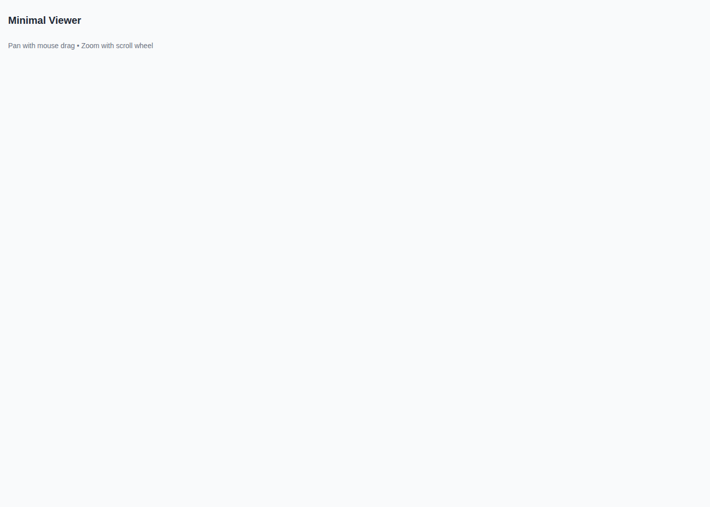
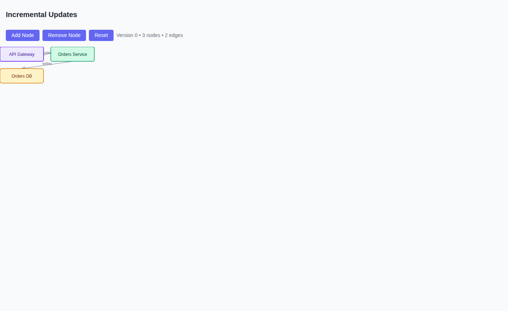
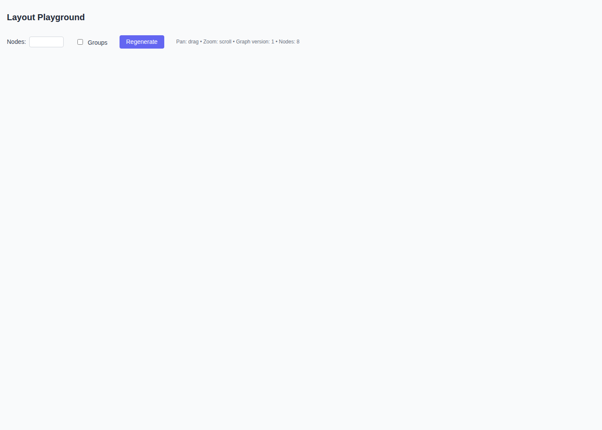
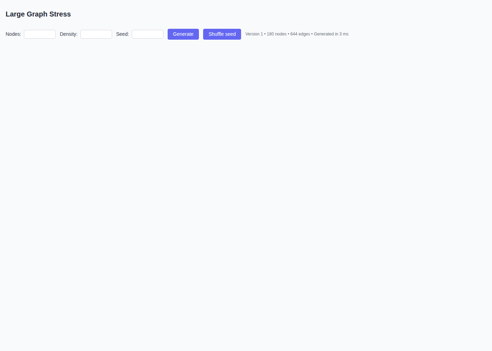
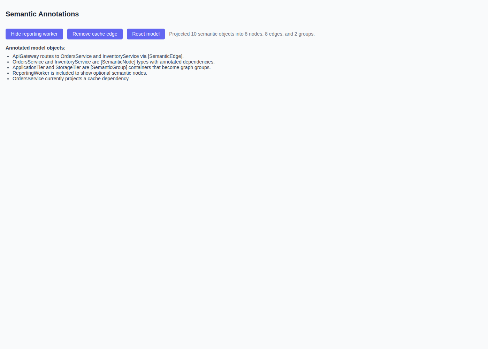

# Samples

This repository currently includes five runnable samples under `/samples`. They are intended to show focused slices of the BlazorFlowGraph stack rather than a single end-to-end demo application.

## Running all samples

```bash
./tooling/scripts/run-samples-all.sh
bash tooling/scripts/run-samples-all.sh --dry-run
```

Open the sample index on `http://localhost:5100` (or your workspace-forwarded equivalent URL).
The sample devcontainer entry point is `.devcontainer/samples/devcontainer.json`, which runs `bash tooling/scripts/run-samples-all.sh --detach --log-file /tmp/blazor-flow-graph-samples.log`.
That detached launcher manages the fixed sample ports `5100` through `5105`, stores PID files under `/tmp/blazor-flow-graph-samples`, and treats an already-running complete sample set as a successful no-op.

## Sample index

| Sample | Purpose | Topic | Port | Run command |
| --- | --- | --- | --- | --- |
| `SampleIndex` | Registry-driven index linking to every sample. | Workspace discovery and launch | `5100` | `dotnet run --project samples/SampleIndex/SampleIndex.csproj --launch-profile Sample` |
| `MinimalViewer` | Smallest possible hosted graph viewer with a static snapshot. | Blazor hosting + graph rendering | `5101` | `dotnet run --project samples/MinimalViewer/MinimalViewer.csproj --launch-profile Sample` |
| `IncrementalUpdates` | Shows the graph evolving across snapshot versions. | Diff-based reconciliation | `5102` | `dotnet run --project samples/IncrementalUpdates/IncrementalUpdates.csproj --launch-profile Sample` |
| `LayoutPlayground` | Lets you vary graph size and optional grouping. | Layout stability and grouping | `5103` | `dotnet run --project samples/LayoutPlayground/LayoutPlayground.csproj --launch-profile Sample` |
| `LargeGraphStress` | Generates larger synthetic graphs with density and seed controls. | Scale and performance exploration | `5104` | `dotnet run --project samples/LargeGraphStress/LargeGraphStress.csproj --launch-profile Sample` |
| `SemanticAnnotations` | Projects annotated CLR objects into a graph. | Semantic modeling and reflection-based projection | `5105` | `dotnet run --project samples/SemanticAnnotations/SemanticAnnotations.csproj --launch-profile Sample` |

## MinimalViewer

**Purpose:** demonstrate the thinnest useful Blazor integration for rendering a graph snapshot.

**What it covers:** a static `GraphSnapshot`, basic node kinds, and the browser bundle hookup required to render the SVG graph.



**Possible extensions**

- Replace the hard-coded snapshot with a semantic model projected through `IGraphProjector`.
- Add overlays, style-token customization, or legends for node kinds.
- Show how to persist viewport state between renders.

## IncrementalUpdates

**Purpose:** demonstrate how versioned snapshots can add and remove nodes without rebuilding the hosting app.

**What it covers:** incremental snapshot updates, stable node retention across versions, and visible graph growth/shrink behavior.



**Possible extensions**

- Add scenario buttons for rename, rewire, and group membership updates.
- Surface the generated diff operations beside the rendered graph.
- Compare "small patch" updates with full graph replacement behavior.

## LayoutPlayground

**Purpose:** provide an interactive sandbox for trying different graph sizes and optional grouping.

**What it covers:** regeneration of topologies, node-kind variety, group creation, and quick manual inspection of layout stability.



**Possible extensions**

- Add selectable layout strategies once more providers exist.
- Expose spacing, rank direction, and viewport diagnostics in the UI.
- Add stress presets that reproduce specific layout edge cases.

## LargeGraphStress

**Purpose:** provide a runnable sample for testing how the renderer behaves with larger synthetic graphs.

**What it covers:** generated node/edge counts, reproducible seeds, adjustable density, and fast regeneration for manual performance checks.



**Possible extensions**

- Add viewport and frame-timing telemetry.
- Add grouped synthetic graphs to stress group rendering as well as node counts.
- Capture generation presets for "medium", "large", and "extreme" scenarios.

## SemanticAnnotations

**Purpose:** show how semantic domain objects decorated with `SemanticNode`, `SemanticEdge`, and `SemanticGroup` attributes become a projected graph.

**What it covers:** reflection-based projection, optional semantic relationships, and group containers that become visual graph groups.



**Possible extensions**

- Show the annotated C# model and the projected snapshot side by side.
- Add a richer domain example with more than one bounded context.
- Demonstrate incremental re-projection from long-lived semantic objects.

## Candidate topics for future samples

- viewport culling and visible-graph debugging
- search, filtering, and query-driven graph views
- overlay badges, diagnostics, and style-token customization
- persisted layout and viewport state across sessions
- real-time updates from a SignalR or background processing feed
- hierarchical groups and group expansion/collapse scenarios
- diff inspection tooling that renders patch operations alongside the graph
- layout-provider comparison once ELK-backed flows become first-class
